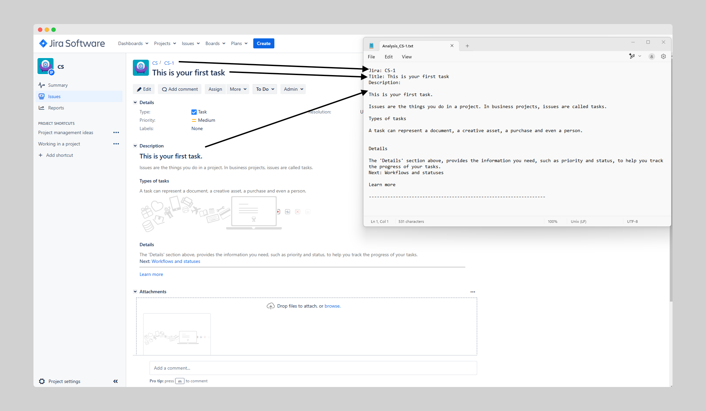

# Jira Details Chrome Extension

Jira Details is a Chrome extension that allows users to extract and manage Jira issue details, including title and description. The extension provides features to copy details to the clipboard or save them as a file.



## Features

- Extract Jira issue title and description.
- Copy details to clipboard.
- Save details as a file.
- Lightweight and easy to use.

## Installation

1. Clone this repository:
   ```bash
   git clone https://github.com/tshenolo/chrome-jira-details.git
   ```
2. Open Chrome and navigate to `chrome://extensions/`.
3. Enable **Developer mode** (toggle in the top right corner).
4. Click **Load unpacked** and select the `chrome-jira-details` folder from the cloned repository.

## Usage

1. Navigate to any Jira issue page.
2. Click the Jira Details extension icon in the Chrome toolbar.
3. Use the popup interface to copy details or save them as a file.

## Permissions

This extension requires the following permissions:

- `storage` - To store user preferences.
- `activeTab` - To access the active tab and extract Jira details.
- `scripting` - To run scripts on Jira pages.

## File Structure

```
chrome-jira-details/
├── background.js       # Handles background tasks
├── manifest.json       # Extension metadata and permissions
├── popup.html          # UI for the extension
├── popup.js            # Logic for the popup interface
├── icons/              # Extension icons
│   ├── 16.png
│   ├── 32.png
│   ├── 48.png
│   ├── 128.png
│   └── 512.png
├── README.md           # Project documentation
```

## Contributing

Contributions are welcome! Feel free to open an issue or submit a pull request.

1. Fork the repository.
2. Create a new branch (git checkout -b feature-branch).
3. Commit your changes (git commit -am 'Add new feature').
4. Push to the branch (git push origin feature-branch).
5. Create a new Pull Request.

## License

This project is licensed under the MIT License.

## Contact

For any inquiries or support, reach out via GitHub Issues.

